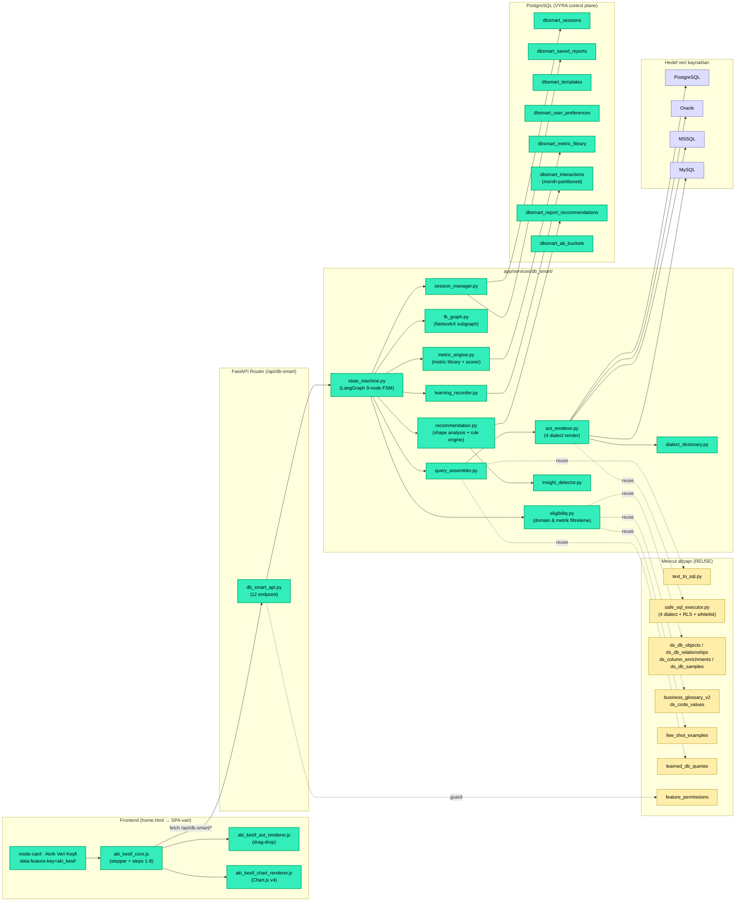
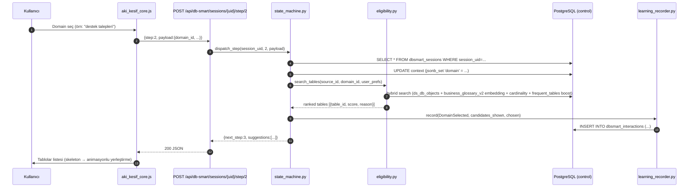
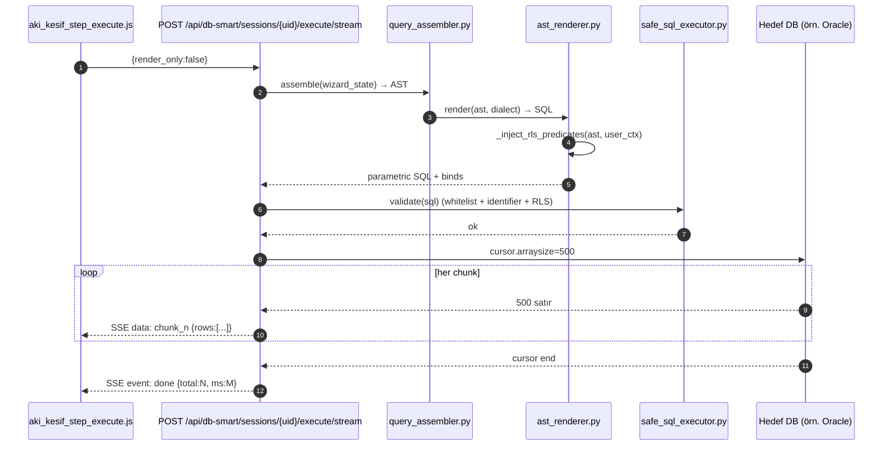

# Akıllı Veri Keşfi — Mimari (v3.30.0 FAZ 0)

> **Plan:** [`.agents/plans/v3.30.0_db_smart_wizard.md`](../../.agents/plans/v3.30.0_db_smart_wizard.md)
> **Vizyon belgesi:** `db_smart_prompts.md` (kullanıcı tarafı referans)
> **Durum:** FAZ 0 — mimari + veri modeli + state machine + tooling

---

## 1. Modül Konumu (kuş bakışı)

Akıllı Veri Keşfi (kart kodu `aki_kesif`), home.html'deki **4. mode-card** olarak mevcut
3 modülün (kb, db, llm) yanına eklenir; **mevcut akışları değiştirmez**. Wizard tarzı
adım-adım deneyim, mevcut text-to-SQL/RAG/öğrenme/multi-DB altyapısının üzerinde
**paralel ikinci giriş**tir.

> **Renk anahtarı:** turkuaz = v3.30.0 yeni, kahve/sarı = mevcut yeniden kullanılan,
> mavi = bağlandığımız harici DB.

---

## 2. Servis Envanteri (FAZ 0 paket iskeleti)

`app/services/db_smart/` paketi (her dosya 150 satır altında — chunk limiti):

| Dosya | Sorumluluk | Faz |
|---|---|---|
| `__init__.py` | Paket girişi, public API export | FAZ 0 |
| `state_machine.py` | LangGraph 9-node FSM (init→domain→tables→date→filter→metric→output→preview→execute) | FAZ 0 |
| `session_manager.py` | dbsmart_sessions CRUD + Redis L1 cache | FAZ 0 |
| `eligibility.py` | Domain/tablo search + metric eligibility scorer | FAZ 0 (stub), FAZ 1 |
| `fk_graph.py` | NetworkX subgraph build/expand/path-suggest | FAZ 0 (stub), FAZ 1 |
| `metric_engine.py` | metric_library load + applicable_when match | FAZ 0 (stub), FAZ 1 |
| `query_assembler.py` | wizard_state → AST → SQL | FAZ 0 (stub), FAZ 1 |
| `ast_renderer.py` | AST node tree + 4 dialect render + RLS inject | FAZ 0 (stub), FAZ 1 |
| `dialect_dictionary.py` | PG/Oracle/MSSQL/MySQL fonksiyon eşleştirmeleri | FAZ 3 |
| `custom_metric_parser.py` | NL→SQL custom metric (LLM bounded) | FAZ 2 |
| `recommendation.py` | Sonuç shape analysis + rule engine + viz öneri | FAZ 2 |
| `insight_detector.py` | Z-score, IQR, seasonality-aware anomaly | FAZ 2/4 |
| `learning_recorder.py` | dbsmart_interactions event yazıcı + PII masking | FAZ 0 (stub), FAZ 2 |
| `feature_store.py` | MV-bazlı user/table/query feature toplama | FAZ 4 |
| `ml_pipeline.py` | wizard_rankers train/eval/promote (mevcut job_runner üzerinden) | FAZ 4 |
| `bandit.py` | Thompson sampling exploration | FAZ 4 |
| `ab_testing.py` | feature_permissions + dbsmart_ab_buckets bucketing | FAZ 4 |
| `narrative_writer.py` | Sonuç → Türkçe özet (LLM bounded, opsiyonel) | FAZ 4 |

> **FAZ 0 hedefi:** Her dosya iskelet (docstring + imports + sınıf/fonksiyon stub).
> İmplementasyon Faz 1+'da ilgili gate'lerde.

---

## 3. Veri Akışları (sequence)

### 3.1 Wizard adım geçişi (kullanıcı domain seçti)

### 3.2 SQL execute (streaming, >100K satır)

---

## 4. Teknoloji Stack Notları

| Katman | Teknoloji | Karar gerekçesi |
|---|---|---|
| State machine | **LangGraph** (mevcut, [app/services/pipeline/graph.py:74](../../app/services/pipeline/graph.py#L74) referans) | Conditional edge + back-nav + checkpointer mevcut pattern |
| FK graph | **NetworkX** (mevcut [requirements.txt](../../requirements.txt) varsa; yoksa adj-list pure-Python) | Shortest path + junction detection |
| Chart | **Chart.js v4 UMD offline** (~80 KB) + d3 mini (treemap/heatmap için) | No-CDN, offline-first |
| SQL highlight | **highlight.js core+sql** offline (~30 KB) | Live preview için |
| Cache | **Redis L1** (mevcut) — session 30dk, eligibility 1h, metadata 4h | Mevcut pattern |
| ML | **CatBoost** (mevcut [app/services/ml/catboost_trainer.py](../../app/services/ml/catboost_trainer.py)) | 5 wizard_rankers/*.cbm, lokal CPU |
| Scheduler | **In-process daemon** (mevcut [app/api/main.py:74](../../app/api/main.py#L74)) | Celery yok; yeni bağımlılık yok |
| Feature flag | **feature_permissions** (mevcut [app/api/routes/feature_permissions.py:29](../../app/api/routes/feature_permissions.py#L29)) | KNOWN_FEATURE_KEYS += "aki_kesif" |
| A/B bucket | **dbsmart_ab_buckets** (yeni tablo) | Variant rotasyonu — user_id%100 |
| Streaming | **FastAPI StreamingResponse** + engine cursor (psycopg2 / oracledb / pymssql / pymysql SSCursor) | 4 dialect uyumlu |
| Observability | **Langfuse trace** (mevcut) + dbsmart_interactions (özel telemetri) | LLM + UX olayları |

> **Yeni paket eklemeleri:** sıfır zorunlu yeni Python paketi. NetworkX zaten projede
> bulunabilir; yoksa adj-list pure-Python fallback kullanılır (Faz 0 G0.4'te kontrol edilir).

---

## 5. Çoklu Tenant + Güvenlik

**RLS politikası** her yeni tabloda:
- `dbsmart_sessions`, `dbsmart_saved_reports`, `dbsmart_user_preferences`,
  `dbsmart_interactions`, `dbsmart_ab_buckets` → `(user_id = current_setting('vyra.user_id')::int OR
  company_id = current_setting('vyra.company_id')::int AND is_admin)`
- `dbsmart_templates`, `dbsmart_metric_library`, `dbsmart_report_recommendations` →
  global okuma (is_official=TRUE) + company-scope yazma

**SQL injection katmanları:**
1. **Identifier whitelist** — `wizard_state.selected_tables/selected_columns` dışındaki
   isimler **reddedilir** (`safe_sql_executor._safe_identifier` ile aynı pattern).
2. **Parametre placeholder zorunlu** — değerler asla string concat ile gömülmez.
3. **AST validation** — LLM custom metric yolu sonrası AST parser tekrar kontrol eder.
4. **RLS injection** — render'ın **son** adımı zorunlu `_inject_rls_predicates` (LLM
   atlamış olsa bile).

**PII masking:**
- `dbsmart_interactions` payload'larına yazılan kolon değerleri
  `ds_column_enrichments.is_pii=TRUE` ise `***MASKED***` yazılır.
- `narrative_writer` (Faz 4) yalnızca aggregated metrik metni üretir (ham satır görmez).

---

## 6. Deployment Şeması

| Bileşen | Konum | Restart? |
|---|---|---|
| Migration 032/033/034 | `migrations/versions/` | run_migrations.py otomatik (start.ps1 adım 1.5) |
| schema.py CREATE IF NOT EXISTS | `app/core/schema.py` | Backend startup'ta idempotent |
| Backend router | `app/api/main.py::include_router(db_smart_api.router)` | Backend restart gerek |
| Frontend assets | `frontend/assets/js/modules/aki_kesif_*.js` + CSS | `node frontend/build.mjs` zorunlu |
| home.html değişikliği | `frontend/home.html` (4. mode-card) | Hard refresh |
| feature_permissions seed | Migration 032 içinde idempotent INSERT | Tek seferlik |
| system_settings.app_version | '3.30.0' (FAZ 5 sonu) | UPDATE |

---

## 7. Faz Geçiş Kapıları (özet)

- **FAZ 0 → 1**: Migration head=034, RLS smoke 5/5 yeşil, state machine 9 node ardışık geçiş smoke, router 12 endpoint kaydı (501 stub döner)
- **FAZ 1 → 2**: Wizard adım 1-5 E2E (PG kaynak ile), 3 domain × 24 metrik seed, 132 dialect testcase başlama
- **FAZ 2 → 3**: Adım 6-7-8 + drag-drop AST + 3 viz tipi + interactions kayıt
- **FAZ 3 → 4**: SSE streaming 50K satır, 132 dialect yeşil, save/share/schedule (in-app snapshot)
- **FAZ 4 → 5**: CatBoost 5 model MRR>0.6 baseline, A/B framework, anomaly insight
- **FAZ 5 kapanış**: Mobile responsive, a11y >95, v3.30.0 versiyon senkronu

---

## 8. Out-of-scope (v3.30.0)

- **MCP server expose** → v3.31.0 ayrı plan
- **E-mail/PDF rapor delivery** → SMTP altyapısı yok, ileri housekeeping
- **Mobile native app** → sadece responsive web
- **Yeni LLM provider** → Qwen + cloud fallback yeterli
