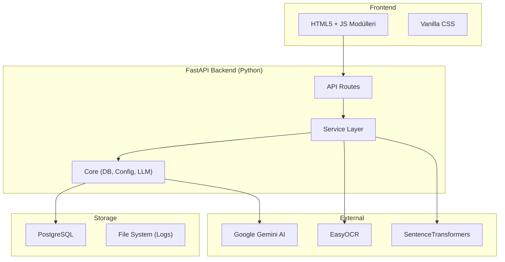

# 🏗️ Mimari Tasarım

| Bilgi | Değer |
|-------|-------|
| **Versiyon** | v2.36.1 |
| **Son Güncelleme** | 2026-02-10 |
| **Durum** | ✅ Güncel |

---

## 📖 İçindekiler

| # | Doküman | Açıklama |
|---|---------|----------|
| 1 | [Sistem Mimarisi](system_overview.md) | Katmanlar, veri akışı, teknoloji yığını |
| 2 | [Veritabanı Şeması](database_schema.md) | Tablolar, ilişkiler, indeksler |
| 3 | [API Referansı](api_reference.md) | Tüm endpoint'ler, input/output |
| 4 | [Güvenlik Modeli](security_model.md) | JWT, RBAC, rate limiting |

---

## Genel Mimari

> 📌 Detaylı katman açıklamaları için [Sistem Mimarisi](system_overview.md) dokümanına bakınız.
