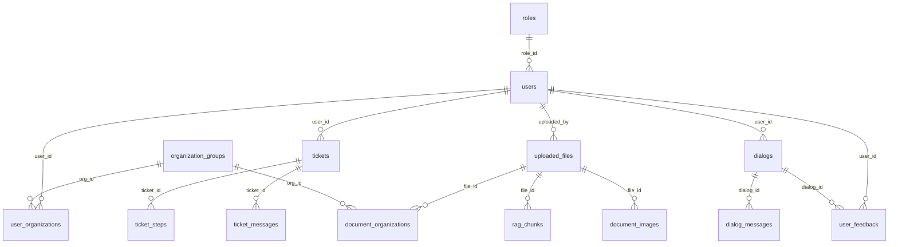

# Veritabanı Şeması

| Bilgi | Değer |
|-------|-------|
| **Versiyon** | v2.36.1 |
| **Son Güncelleme** | 2026-02-10 |
| **DBMS** | PostgreSQL 16+ |
| **Port** | 5432 |
| **Kaynak** | `app/core/schema.py` |
| **Durum** | ✅ Güncel |

---

## 1. Tablo Listesi

| # | Tablo | Amaç | İlişkiler |
|---|-------|------|-----------|
| 1 | `roles` | Sistem rolleri (admin/user) | → users |
| 2 | `users` | Kullanıcı hesapları | → roles, → organization_groups |
| 3 | `organization_groups` | Organizasyon birimleri | → users (created_by) |
| 4 | `user_organizations` | Kullanıcı-org M:N ilişkisi | → users, → organization_groups |
| 5 | `tickets` | Destek talepleri | → users |
| 6 | `ticket_steps` | Ticket çözüm adımları | → tickets |
| 7 | `ticket_messages` | Ticket sohbet mesajları | → tickets |
| 8 | `solution_logs` | Çözüm geçmişi | → tickets, → users |
| 9 | `llm_config` | LLM yapılandırması | — |
| 10 | `system_logs` | Sistem logları | → users |
| 11 | `prompt_templates` | Prompt şablonları | — |
| 12 | `uploaded_files` | Yüklenen dokümanlar (BYTEA) | → users |
| 13 | `rag_chunks` | RAG vektör chunk'ları | → uploaded_files |
| 14 | `document_organizations` | Doküman-org M:N ilişkisi | → uploaded_files, → organization_groups |
| 15 | `document_images` | Doküman görselleri (BYTEA+OCR) | → uploaded_files |
| 16 | `dialogs` | Sohbet oturumları | → users |
| 17 | `dialog_messages` | Sohbet mesajları | → dialogs |
| 18 | `user_feedback` | Kullanıcı geri bildirimleri | → users |
| 19 | `training_samples` | ML eğitim verileri | → users |
| 20 | `catboost_models` | Eğitilmiş ML modelleri | → users |
| 21 | `permissions` | Modül yetkileri | — |

---

## 2. Tablo Detayları

### 2.1 `users` — Kullanıcılar

```sql
CREATE TABLE IF NOT EXISTS users (
    id              SERIAL PRIMARY KEY,
    full_name       VARCHAR(255) NOT NULL,
    username        VARCHAR(100) NOT NULL UNIQUE,
    email           VARCHAR(255) NOT NULL UNIQUE,
    phone           VARCHAR(20) NOT NULL,
    password        TEXT NOT NULL,          -- bcrypt hash
    avatar          TEXT,
    role_id         INTEGER REFERENCES roles(id) DEFAULT 2,
    is_admin        BOOLEAN DEFAULT FALSE,
    is_approved     BOOLEAN DEFAULT FALSE,
    approved_by     INTEGER REFERENCES users(id),
    approved_at     TIMESTAMP,
    created_at      TIMESTAMP DEFAULT CURRENT_TIMESTAMP
);
```

**İndeksler:**
| İndeks | Sütun | Amaç |
|--------|-------|------|
| `idx_users_username` | username | Login araması |
| `idx_users_email` | email | Unique kontrol |
| `idx_users_role_id` | role_id | Rol filtresi |
| `idx_users_is_approved` | is_approved | Onay filtresi |
| `idx_users_phone` | phone | Telefon araması |

---

### 2.2 `tickets` — Destek Talepleri

```sql
CREATE TABLE IF NOT EXISTS tickets (
    id               SERIAL PRIMARY KEY,
    user_id          INTEGER NOT NULL REFERENCES users(id),
    title            VARCHAR(500) NOT NULL,
    description      TEXT NOT NULL,
    source_type      VARCHAR(100),
    source_name      VARCHAR(255),
    final_solution   TEXT,
    cym_text         TEXT,
    cym_portal_url   VARCHAR(500),
    llm_evaluation   TEXT,
    rag_results      JSONB DEFAULT '[]',
    interaction_type VARCHAR(50) DEFAULT 'rag_only',
    source_org_ids   INTEGER[] DEFAULT '{}',
    status           VARCHAR(50) DEFAULT 'open',
    created_at       TIMESTAMP DEFAULT CURRENT_TIMESTAMP,
    updated_at       TIMESTAMP DEFAULT CURRENT_TIMESTAMP
);
```

**Özel Alanlar:**
| Alan | Tip | Açıklama |
|------|-----|----------|
| `rag_results` | JSONB | RAG sonuç chunk listesi |
| `interaction_type` | VARCHAR | `rag_only`, `user_selection`, `ai_evaluation` |
| `source_org_ids` | INTEGER[] | Kullanılan org grupları |

---

### 2.3 `uploaded_files` — Yüklenen Dokümanlar

```sql
CREATE TABLE IF NOT EXISTS uploaded_files (
    id              SERIAL PRIMARY KEY,
    file_name       VARCHAR(500) NOT NULL,
    file_type       VARCHAR(50) NOT NULL,
    file_size_bytes BIGINT,
    file_content    BYTEA NOT NULL,
    mime_type       VARCHAR(100),
    chunk_count     INTEGER DEFAULT 0,
    maturity_score  REAL DEFAULT NULL,
    uploaded_by     INTEGER REFERENCES users(id),
    uploaded_at     TIMESTAMP DEFAULT CURRENT_TIMESTAMP
);
```

---

### 2.4 `rag_chunks` — RAG Vektör Chunk'ları

```sql
CREATE TABLE IF NOT EXISTS rag_chunks (
    id              SERIAL PRIMARY KEY,
    file_id         INTEGER NOT NULL REFERENCES uploaded_files(id) ON DELETE CASCADE,
    chunk_index     INTEGER NOT NULL,
    chunk_text      TEXT NOT NULL,
    embedding       FLOAT[] DEFAULT NULL,  -- 384 boyut vektör
    metadata        JSONB,
    created_at      TIMESTAMP DEFAULT CURRENT_TIMESTAMP
);
```

**Önemli:** `embedding` alanı SentenceTransformer (all-MiniLM-L6-v2) modelinin ürettiği 384 boyutlu float dizisidir.

---

### 2.5 `document_images` — Doküman Görselleri

```sql
CREATE TABLE IF NOT EXISTS document_images (
    id                  SERIAL PRIMARY KEY,
    file_id             INTEGER NOT NULL REFERENCES uploaded_files(id) ON DELETE CASCADE,
    image_index         INTEGER NOT NULL,
    image_data          BYTEA NOT NULL,
    image_format        VARCHAR(10) NOT NULL,
    width_px            INTEGER,
    height_px           INTEGER,
    file_size_bytes     INTEGER,
    context_heading     VARCHAR(500),
    context_chunk_index INTEGER,
    alt_text            TEXT DEFAULT '',
    ocr_text            TEXT DEFAULT '',
    created_at          TIMESTAMP DEFAULT CURRENT_TIMESTAMP
);
```

**İndeksler:**
| İndeks | Sütun | Amaç |
|--------|-------|------|
| `idx_document_images_file_id` | file_id | Dosya görselleri |
| `idx_document_images_context` | file_id, context_chunk_index | Chunk bağlamı |

---

### 2.6 `llm_config` — LLM Yapılandırması

```sql
CREATE TABLE IF NOT EXISTS llm_config (
    id              SERIAL PRIMARY KEY,
    vendor_code     VARCHAR(100),
    provider        VARCHAR(100) NOT NULL,
    model_name      VARCHAR(255) NOT NULL,
    api_url         VARCHAR(500) NOT NULL,
    api_token       TEXT,
    temperature     REAL DEFAULT 0.7,
    top_p           REAL DEFAULT 1.0,
    timeout_seconds INTEGER DEFAULT 60,
    is_active       BOOLEAN DEFAULT FALSE,
    description     TEXT,
    created_at      TIMESTAMP DEFAULT CURRENT_TIMESTAMP,
    updated_at      TIMESTAMP DEFAULT CURRENT_TIMESTAMP
);
```

---

### 2.7 `user_feedback` — Kullanıcı Geri Bildirimleri

```sql
CREATE TABLE IF NOT EXISTS user_feedback (
    id              SERIAL PRIMARY KEY,
    user_id         INTEGER NOT NULL REFERENCES users(id),
    ticket_id       INTEGER REFERENCES tickets(id),
    chunk_id        INTEGER,
    feedback_type   VARCHAR(50) NOT NULL,   -- 'helpful', 'not_helpful'
    query_text      TEXT,                   -- v2.38.4: Kullanıcının sorduğu soru
    response_text   TEXT,                   -- Bot yanıtı
    dialog_id       INTEGER,               -- v2.38.4: Dialog referansı
    created_at      TIMESTAMP DEFAULT CURRENT_TIMESTAMP
);
```

**v2.38.4 İyileştirme:** `query_text` ve `dialog_id` artık otomatik doldurulur — ML öğrenme verisi zenginleştirildi.

---

## 3. İlişki Diyagramı (ER)



---

## 4. CASCADE Silme Politikası

| Parent | Child | Politika |
|--------|-------|----------|
| `uploaded_files` | `rag_chunks` | ON DELETE CASCADE |
| `uploaded_files` | `document_images` | ON DELETE CASCADE |
| `uploaded_files` | `document_organizations` | ON DELETE CASCADE |
| `tickets` | `ticket_steps` | ON DELETE CASCADE |
| `tickets` | `ticket_messages` | ON DELETE CASCADE |
| `users` | `user_organizations` | ON DELETE CASCADE |

---

> 📌 API kullanım detayları: [API Referansı](api_reference.md)
