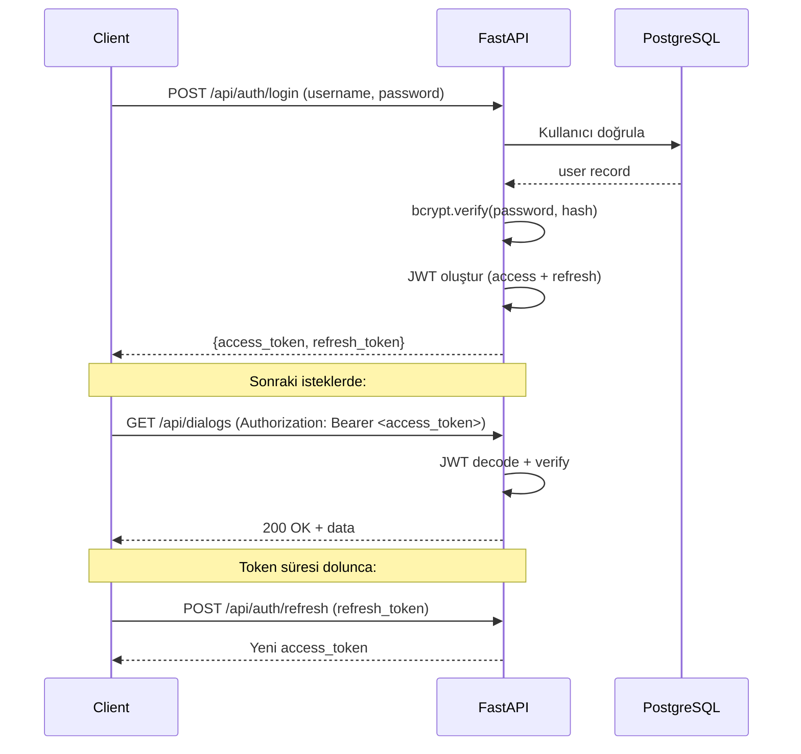

# Güvenlik Modeli

| Bilgi | Değer |
|-------|-------|
| **Versiyon** | v2.36.1 |
| **Son Güncelleme** | 2026-02-10 |
| **Durum** | ✅ Güncel |

---

## 1. Kimlik Doğrulama (Authentication)

### JWT (JSON Web Token) Sistemi

| Token Tipi | Süre | Kullanım |
|------------|------|----------|
| **Access Token** | 12 saat | API isteklerinde `Authorization: Bearer <token>` |
| **Refresh Token** | 7 gün | Access token yenilemek için |

### Token Akışı



### Şifre Güvenliği

| Özellik | Detay |
|---------|-------|
| **Hash Algoritması** | bcrypt |
| **Salt** | Otomatik (bcrypt built-in) |
| **Minimum Uzunluk** | 8 karakter |
| **Saklama** | Sadece hash saklanır, ham şifre ASLA |

### Token Payload Yapısı
```json
{
    "sub": "ahmet.yilmaz",
    "exp": 1739181600,
    "type": "access",
    "role": "admin"
}
```

---

## 2. Yetkilendirme (Authorization - RBAC)

### Rol Yapısı

| Rol | Açıklama | Yetki Seviyesi |
|-----|----------|----------------|
| `user` | Standart kullanıcı | Temel işlemler |
| `admin` | Sistem yöneticisi | Tüm işlemler |

### Endpoint Yetki Matrisi

| Endpoint Grubu | user | admin |
|----------------|------|-------|
| Auth (login/register) | ✅ | ✅ |
| Dialog (soru sorma) | ✅ | ✅ |
| RAG Search (arama) | ✅ | ✅ |
| RAG Upload (yükleme) | ⚙️ | ✅ |
| Ticket (oluşturma) | ✅ | ✅ |
| Feedback (geri bildirim) | ✅ | ✅ |
| User Admin (yönetim) | ❌ | ✅ |
| Org Management | ❌ | ✅ |
| LLM Config | ❌ | ✅ |
| Prompt Yönetimi | ❌ | ✅ |
| Permission Yönetimi | ❌ | ✅ |
| System Yönetimi | ❌ | ✅ |

⚙️ = Admin tarafından yapılandırılabilir

### Dependency Injection

```python
# Standart kullanıcı kontrolü
@router.get("/dialogs")
async def list_dialogs(current_user = Depends(get_current_user)):
    ...

# Admin yetkisi kontrolü
@router.delete("/files/{file_id}")
async def delete_file(current_user = Depends(get_current_admin)):
    ...
```

---

## 3. Veri İzolasyonu

### Organizasyon Bazlı İzolasyon
- Kullanıcılar sadece atandıkları organizasyonların verilerini görebilir
- RAG araması org_id filtresiyle sınırlandırılır
- Ticket'lar `source_org_ids` ile ilişkilendirilir

### IDOR Koruması
- Ticket detay görüntüleme: `user_id` kontrolü yapılır
- Kullanıcı sadece kendi ticket'larını görebilir
- Admin tüm ticket'lara erişebilir

---

## 4. SQL Injection Koruması

Tüm veritabanı sorguları **parameterized query** kullanır:

```python
# ✅ DOĞRU — Parameterized
cur.execute("SELECT * FROM users WHERE id = %s", (user_id,))

# ❌ YANLIŞ — String interpolation (KULLANILMIYOR)
cur.execute(f"SELECT * FROM users WHERE id = {user_id}")
```

---

## 5. Rate Limiting

| Endpoint | Limit | Period |
|----------|-------|--------|
| Login | 5 istek | dakika |
| Register | 3 istek | dakika |
| API genel | 100 istek | dakika |

**Implementasyon:** `app/core/rate_limiter.py`

---

## 6. CORS ve Güvenlik Header'ları

| Header | Değer |
|--------|-------|
| CORS | Localhost origins |
| Content-Type | application/json |
| X-Content-Type-Options | nosniff |

---

## 7. Hassas Veri Yönetimi

| Veri | Saklama | Erişim |
|------|---------|--------|
| Şifreler | bcrypt hash (DB) | Hiçbir zaman açık metin |
| JWT Secret | .env dosyası | Sadece backend |
| LLM API Key | DB (llm_config) | Sadece admin UI |
| Dosya İçeriği | BYTEA (DB) | Auth required |

---

## 8. Loglama ve Denetim

### System Logs Tablosu
Tüm önemli işlemler `system_logs` tablosuna kaydedilir:

| Alan | Açıklama |
|------|----------|
| `level` | INFO, WARNING, ERROR |
| `message` | İşlem açıklaması |
| `module` | Kaynak modül |
| `user_id` | İşlemi yapan kullanıcı |
| `request_path` | API path |
| `request_method` | GET/POST/PUT/DELETE |
| `response_status` | HTTP durum kodu |
| `error_detail` | Hata detayı (varsa) |

---

> 📌 Teknik bileşen detayları: [Bileşen Dokümantasyonu](../03_components/README.md)
