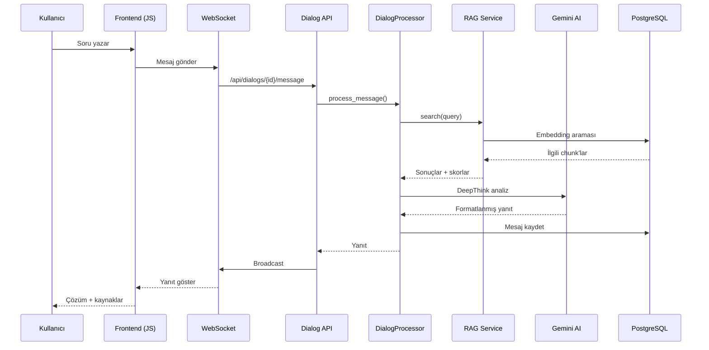
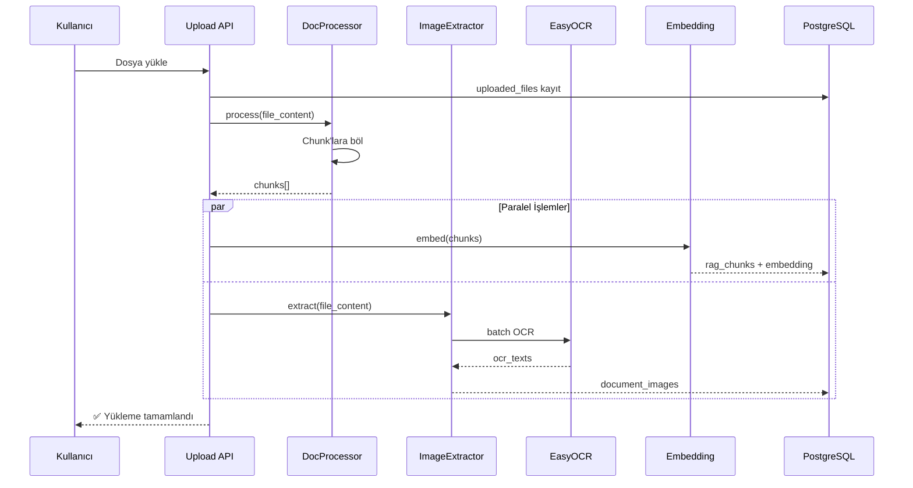

# Sistem Mimarisi

| Bilgi | Değer |
|-------|-------|
| **Versiyon** | v2.36.1 |
| **Son Güncelleme** | 2026-02-10 |
| **Durum** | ✅ Güncel |

---

## 1. Teknoloji Yığını

| Katman | Teknoloji | Versiyon |
|--------|-----------|----------|
| **Backend** | Python + FastAPI | 3.13 / 0.115+ |
| **Frontend** | Vanilla HTML5 + JavaScript | ES2020+ |
| **CSS** | Vanilla CSS (modüler) | — |
| **Veritabanı** | PostgreSQL | 16+ |
| **AI / LLM** | Google Gemini | 2.0-flash |
| **Embedding** | SentenceTransformers | all-MiniLM-L6-v2 |
| **ML Ranking** | CatBoost | 1.2+ |
| **OCR** | EasyOCR | 1.7+ |
| **WebSocket** | FastAPI WebSocket | — |
| **Auth** | JWT (PyJWT + bcrypt) | — |

---

## 2. Katmanlı Mimari

```
┌─────────────────────────────────────────────────────────┐
│                    FRONTEND LAYER                       │
│  HTML5 Pages → JS Modules → CSS Stylesheets             │
│  login.html, home.html, organization_management.html    │
├─────────────────────────────────────────────────────────┤
│                    API LAYER                             │
│  FastAPI Router → 25 Route dosyası                      │
│  auth, dialog, rag_*, tickets, system, websocket        │
├─────────────────────────────────────────────────────────┤
│                    SERVICE LAYER                         │
│  İş mantığı → 15+ servis dosyası                       │
│  dialog/, rag/, document_processors/, ml_training/      │
├─────────────────────────────────────────────────────────┤
│                    CORE LAYER                            │
│  Altyapı → config, db, llm, cache, schema               │
│  WebSocket Manager, Rate Limiter, Async Task Manager    │
├─────────────────────────────────────────────────────────┤
│                    STORAGE LAYER                         │
│  PostgreSQL → 15+ tablo                                 │
│  File System → logs/, ml_models/                        │
└─────────────────────────────────────────────────────────┘
```

---

## 3. Modül Haritası

### 3.1 Core Modüller (`app/core/`)

| Modül | Dosya | Amaç |
|-------|-------|------|
| **Config** | `config.py` | Ortam değişkenleri, uygulama ayarları |
| **Database** | `db.py` | PostgreSQL bağlantı yönetimi, connection pool |
| **Schema** | `schema.py` | Tüm tablo CREATE ifadeleri |
| **LLM** | `llm.py` | Google Gemini entegrasyonu, multi-provider |
| **Cache** | `cache.py` | In-memory cache (TTL destekli) |
| **RAG Router** | `rag_router.py` | RAG pipeline orchestration |
| **Rate Limiter** | `rate_limiter.py` | API istek sınırlama |
| **WebSocket** | `websocket_manager.py` | Real-time mesajlaşma yönetimi |
| **Async Tasks** | `async_task_manager.py` | Arka plan iş yönetimi |
| **Agents** | `agents.py` | AI agent tanımlamaları |
| **Web Search** | `web_search.py` | Dış kaynak araması |
| **Default Data** | `default_data.py` | Varsayılan prompt ve veri |

### 3.2 API Routes (`app/api/routes/`)

| Route Dosyası | Prefix | Açıklama |
|---------------|--------|----------|
| `auth.py` | `/api/auth` | Kayıt, giriş, JWT |
| `dialog.py` | `/api/dialogs` | Dialog CRUD, mesaj gönderme |
| `rag_upload.py` | `/api/rag` | Dosya yükleme |
| `rag_search.py` | `/api/rag` | Doküman araması |
| `rag_files.py` | `/api/rag` | Dosya listesi, silme |
| `rag_images.py` | `/api/rag` | Görsel endpoint'leri |
| `rag_enhance.py` | `/api/rag` | Doküman iyileştirme |
| `rag_rebuild.py` | `/api/rag` | Vektör indeks yeniden oluşturma |
| `rag_maturity.py` | `/api/rag` | Olgunluk analizi |
| `tickets.py` | `/api/tickets` | Ticket CRUD |
| `feedback.py` | `/api/feedback` | Kullanıcı geri bildirimi |
| `organizations.py` | `/api/organizations` | Org yönetimi |
| `user_admin.py` | `/api/admin/users` | Kullanıcı yönetimi |
| `user_profile.py` | `/api/users` | Profil işlemleri |
| `llm_config.py` | `/api/llm` | LLM yapılandırma |
| `prompts.py` | `/api/prompts` | Prompt şablonları |
| `permissions.py` | `/api/permissions` | RBAC yönetimi |
| `system.py` | `/api/system` | Sistem yönetimi |
| `health.py` | `/api/health` | Sağlık kontrolü |
| `websocket.py` | `/ws` | WebSocket bağlantısı |
| `assets.py` | `/api/assets` | Statik dosya servisi |
| `chat.py` | `/api/chat` | Sohbet geçmişi |
| `rag.py` | `/api/rag` | RAG genel endpoint'ler |
| `users.py` | `/api/users` | Kullanıcı listeleme |

### 3.3 Service Modüller (`app/services/`)

| Servis | Dosya(lar) | Amaç |
|--------|-----------|------|
| **Dialog** | `dialog/processor.py`, `dialog/response_builder.py`, `dialog/messages.py`, `dialog/crud.py` | Mesaj işleme pipeline |
| **RAG** | `rag/service.py`, `rag/embedding.py`, `rag/scoring.py`, `rag/topic_extraction.py` | Doküman arama ve puanlama |
| **Document Processors** | `document_processors/docx_processor.py`, `pdf_processor.py`, `excel_processor.py`, `pptx_processor.py`, `txt_processor.py` | Format-spesifik çıkarma |
| **Image Extractor** | `document_processors/image_extractor.py` | Görsel çıkarma + OCR |
| **DeepThink** | `deep_think_service.py` | LLM ile kapsamlı analiz |
| **CatBoost** | `catboost_service.py` | ML tabanlı sonuç sıralama |
| **Feature Extractor** | `feature_extractor.py` | ML özellik çıkarma |
| **Document Enhancer** | `document_enhancer.py` | LLM ile doküman iyileştirme |
| **Maturity Analyzer** | `maturity_analyzer.py` | Doküman kalite skoru |
| **Feedback** | `feedback_service.py` | Geri bildirim kayıt/analiz |
| **Ticket** | `ticket_service.py` | Ticket iş mantığı |
| **ML Training** | `ml_training_service.py`, `ml_training/` | CatBoost model eğitimi |
| **User Affinity** | `user_affinity_service.py` | Kullanıcı ilgi analizi |
| **Logging** | `logging_service.py` | Sistem loglama |
| **OCR** | `ocr_service.py` | EasyOCR wrapper |

### 3.4 Frontend Modüller (`frontend/assets/js/modules/`)

| Modül | Dosya | Amaç |
|-------|-------|------|
| **Dialog Chat** | `dialog_chat.js` | Ana sohbet arayüzü |
| **Dialog Utils** | `dialog_chat_utils.js` | Yardımcı fonksiyonlar |
| **Dialog Voice** | `dialog_voice.js` | Sesli mesaj |
| **Dialog Images** | `dialog_images.js` | Görsel yönetimi |
| **Dialog Ticket** | `dialog_ticket.js` | Dialog'dan ticket oluşturma |
| **Solution Display** | `solution_display.js` | Yanıt gösterimi |
| **Solution Formatter** | `solution_formatter.js` | Yanıt formatlama |
| **RAG Cards** | `rag_cards.js` | Doküman kartları |
| **RAG File List** | `rag_file_list.js` | Dosya listesi |
| **RAG Org Modal** | `rag_org_modal.js` | Org seçim modalı |
| **RAG File Org Edit** | `rag_file_org_edit.js` | Dosya-org düzenleme |
| **Image Lightbox** | `rag_image_lightbox.js` | Görsel büyütme |
| **OCR Popup** | `rag_ocr_popup.js` | OCR metin popup |
| **Sidebar** | `sidebar_module.js` | Sol menü |
| **ML Training** | `ml_training.js` | Eğitim yönetimi UI |
| **Permissions** | `permissions_manager.js` | İzin yönetimi UI |
| **LLM Module** | `llm_module.js` | LLM ayarları UI |
| **Prompt Module** | `prompt_module.js` | Prompt düzenleyici |
| **Param Tabs** | `param_tabs.js` | Admin tab navigasyonu |
| **Doc Enhancer Modal** | `document_enhancer_modal.js` | Doküman iyileştirme modalı |
| **Maturity Modal** | `maturity_score_modal.js` | Kalite skor modalı |
| **File Guidelines** | `file_guidelines_modal.js` | Dosya kuralları modalı |

---

## 4. Veri Akış Diyagramları

### 4.1 Dialog Pipeline (Soru-Cevap)



### 4.2 RAG Upload Pipeline



---

## 5. Dosya Yapısı

```
D:\VYRA\
├── app/                          # Backend uygulaması
│   ├── __init__.py
│   ├── api/                      # FastAPI route'ları
│   │   └── routes/               # 25 route dosyası
│   ├── core/                     # Altyapı modülleri
│   │   ├── config.py             # Uygulama ayarları
│   │   ├── db.py                 # DB bağlantısı
│   │   ├── llm.py                # LLM entegrasyonu
│   │   ├── cache.py              # In-memory cache
│   │   └── schema.py             # DB şeması
│   ├── models/                   # Pydantic modelleri
│   └── services/                 # İş mantığı
│       ├── dialog/               # Dialog pipeline
│       ├── rag/                  # RAG arama
│       ├── document_processors/  # Dosya işleyiciler
│       └── ml_training/          # ML eğitim
│
├── frontend/                     # Frontend uygulaması
│   ├── home.html                 # Ana sayfa
│   ├── login.html                # Giriş sayfası
│   ├── partials/                 # HTML bölümleri
│   └── assets/
│       ├── js/                   # JavaScript
│       │   ├── modules/          # 30 modül dosyası
│       │   └── *.js              # Ana scriptler
│       ├── css/                  # Stiller
│       └── images/               # Görseller
│
├── tests/                        # Test dosyaları
├── sss/                          # 📚 Teknik dokümantasyon
├── docs/                         # İş dokümanları
├── logs/                         # Uygulama logları
├── ml_models/                    # Eğitilmiş modeller
└── scripts/                      # Yardımcı scriptler
```

---

> 📌 Veritabanı detayları: [Veritabanı Şeması](database_schema.md)
