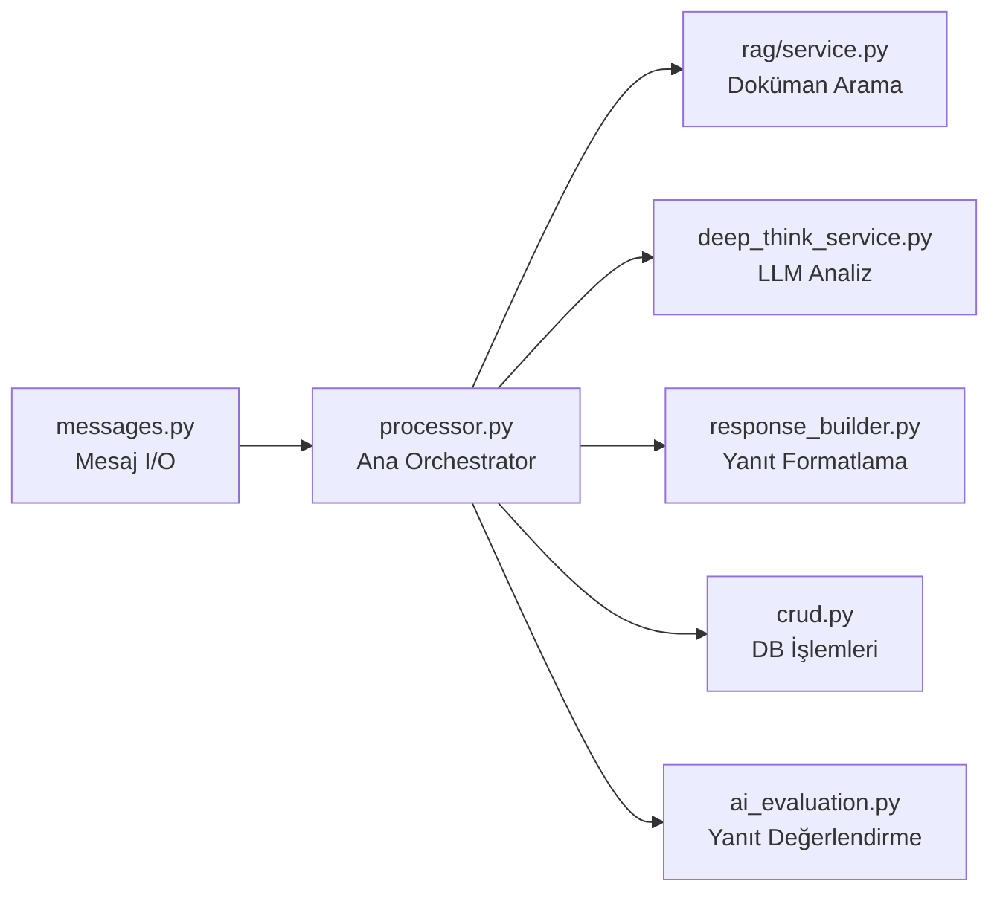
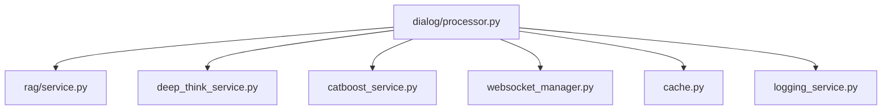

# Dialog Pipeline — Backend Bileşen Dokümantasyonu

| Bilgi | Değer |
|-------|-------|
| **Versiyon** | v2.36.1 |
| **Son Güncelleme** | 2026-02-10 |
| **Konum** | `app/services/dialog/` |
| **Durum** | ✅ Güncel |

---

## 1. Amaç

Dialog Pipeline, kullanıcının sorduğu soruyu alıp RAG araması yaparak, LLM ile analiz edip zengin formatta yanıt üretir. Modüler yapıda 6 alt bileşenden oluşur.

---

## 2. Mimari



---

## 3. Bileşen Detayları

### 3.1 `processor.py` — Ana Orchestrator

| Özellik | Değer |
|---------|-------|
| **Dosya** | `app/services/dialog/processor.py` |
| **Satır** | ~560 satır |
| **Amaç** | Mesaj alımından yanıt teslimatına tüm akış |

#### `DialogProcessor.process_message()`

**Input:**
| Parametre | Tip | Zorunlu | Açıklama |
|-----------|-----|---------|----------|
| `dialog_id` | `int` | ✅ | Dialog oturum ID |
| `user_message` | `str` | ✅ | Kullanıcı sorusu |
| `user_id` | `int` | ✅ | Kullanıcı ID |

**Output:** `Dict`
```python
{
    "response": "VPN bağlantısı için...",       # Ana yanıt
    "sources": [...],                            # Kaynak referansları
    "images": [{"id": 1, "url": "/api/rag/images/1"}],  # Görsel referansları
    "confidence": 0.87,                          # Güven skoru
    "message_id": 123                            # DB mesaj ID
}
```

**Akış:**
1. Kullanıcı mesajını DB'ye kaydet
2. RAG araması yap (embedding + cosine similarity)
3. CatBoost ile sonuçları yeniden sırala
4. DeepThink (LLM) ile detaylı yanıt oluştur
5. response_builder ile HTML formatla
6. Yanıtı DB'ye kaydet ve WebSocket ile broadcast et

---

### 3.2 `response_builder.py` — Yanıt Formatlama

| Özellik | Değer |
|---------|-------|
| **Dosya** | `app/services/dialog/response_builder.py` |
| **Satır** | ~411 satır |
| **Amaç** | RAG sonuçlarını zengin HTML formatına dönüştürme |

#### `format_single_result(match)`

**Input:**
| Parametre | Tip | Açıklama |
|-----------|-----|----------|
| `match` | `Dict` | RAG arama sonucu (chunk_text, file_name, score, metadata) |

**Output:** `str` — Formatlanmış HTML string

**Önemli Özellikler:**
- `metadata.image_ids` varsa `` tag'leri oluşturur
- Maksimum **4 görsel** gösterilir
- `metadata` string ise JSON parse eder
- Geçersiz JSON hata fırlatmaz, boş geçer

**Örnek:**
```python
match = {
    "chunk_text": "VPN adımları...",
    "file_name": "vpn.pdf",
    "similarity_score": 0.85,
    "metadata": {"image_ids": [1, 2]}
}
result = format_single_result(match)
# → '<div class="rag-result">...
#     
#    </div>'
```

---

### 3.3 `messages.py` — Mesaj Yönetimi

| Özellik | Değer |
|---------|-------|
| **Dosya** | `app/services/dialog/messages.py` |
| **Amaç** | Mesaj ekleme, listeleme, format dönüştürme |

#### `add_message(dialog_id, role, content, metadata)`
| Parametre | Tip | Açıklama |
|-----------|-----|----------|
| `dialog_id` | `int` | Dialog ID |
| `role` | `str` | `"user"` veya `"assistant"` |
| `content` | `str` | Mesaj içeriği |
| `metadata` | `dict` | Opsiyonel ek veri |

---

### 3.4 `crud.py` — DB İşlemleri

| Özellik | Değer |
|---------|-------|
| **Dosya** | `app/services/dialog/crud.py` |
| **Amaç** | Dialog CRUD (create, read, update, delete) |

**Fonksiyonlar:**
| Fonksiyon | Input | Output | Açıklama |
|-----------|-------|--------|----------|
| `create_dialog(user_id, title)` | int, str | int (dialog_id) | Yeni dialog oluştur |
| `get_dialog(dialog_id)` | int | Dict | Dialog detay |
| `close_dialog(dialog_id)` | int | bool | Dialog'u kapat |
| `get_user_dialogs(user_id)` | int | List[Dict] | Kullanıcı dialogları |

---

### 3.5 `ai_evaluation.py` — AI Değerlendirme

| Özellik | Değer |
|---------|-------|
| **Dosya** | `app/services/dialog/ai_evaluation.py` |
| **Amaç** | LLM yanıtının kalite değerlendirmesi |

---

## 4. Hata Yönetimi

| Durum | Davranış |
|-------|----------|
| RAG sonuç bulunamadı | Kullanıcıya bilgilendirme mesajı, ticket önerisi |
| LLM timeout | Fallback yanıt (RAG sonuçlarından düz format) |
| DB bağlantı hatası | 500 HTTP, log yazılır |
| WebSocket kopması | Mesaj HTTP yanıtı olarak döner |

---

## 5. Bağımlılıklar


