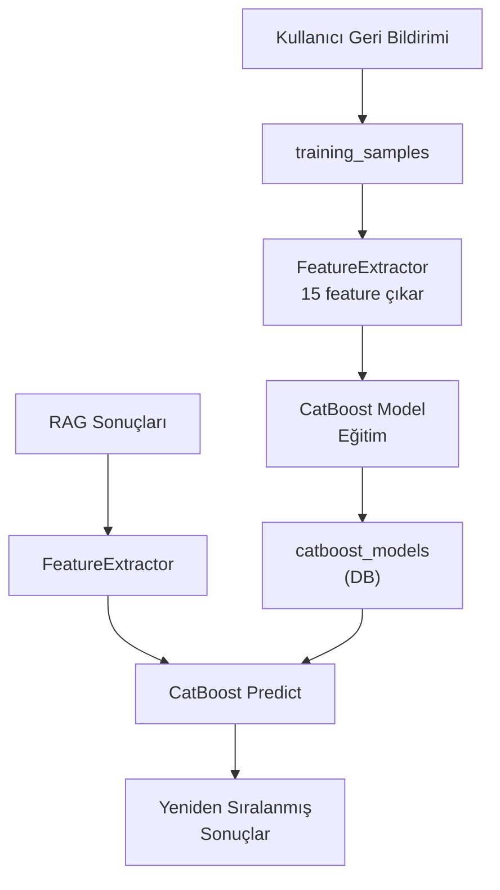
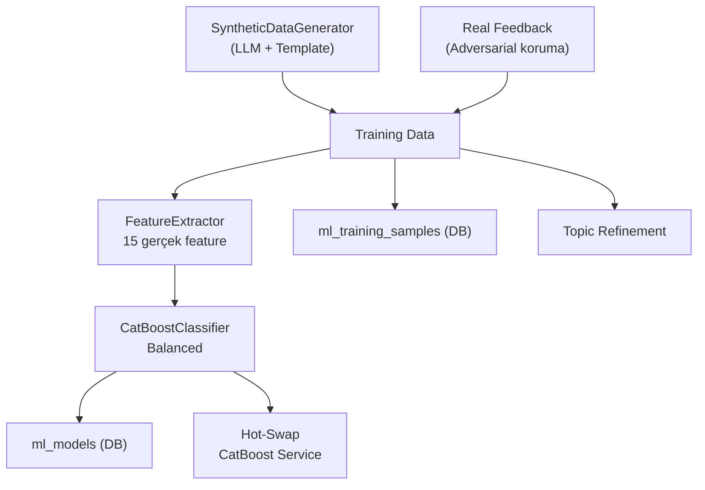

# ML Eğitim — Backend Bileşen Dokümantasyonu

| Bilgi | Değer |
|-------|-------|
| **Versiyon** | v2.45.0 |
| **Son Güncelleme** | 2026-02-16 |
| **Konum** | `app/services/catboost_service.py`, `app/services/feature_extractor.py`, `app/services/ml_training/` |
| **Durum** | ✅ Güncel |

---

## 1. Amaç

Kullanıcı geri bildirimlerinden öğrenen CatBoost ML modeli ile RAG sonuçlarını kişiselleştirilmiş şekilde yeniden sıralama.

---

## 2. Mimari



---

## 3. CatBoost Service

### `CatBoostRerankingService.rerank(results, query, user_id)`

**Input:**
| Parametre | Tip | Açıklama |
|-----------|-----|----------|
| `results` | `List[Dict]` | RAG arama sonuçları |
| `query` | `str` | Kullanıcı sorgusu |
| `user_id` | `int` | Kişiselleştirme için |

**Output:** `List[Dict]` — Yeniden sıralanmış sonuçlar

### `CatBoostRerankingService.is_ready()`
**Output:** `bool` — Model eğitilmiş mi

### `CatBoostRerankingService.get_model_info()`
**Output:** `Dict` — Model detayları
```python
{
    "is_ready": True,
    "feature_count": 15,
    "feature_names": ["cosine_similarity", "exact_match_bonus", ...],
    "model_version": "2026-02-08"
}
```

---

## 4. Feature Extractor (15 Feature)

| # | Feature | Tip | Açıklama |
|---|---------|-----|----------|
| 1 | `cosine_similarity` | float | Vektör benzerliği |
| 2 | `exact_match_bonus` | float | Teknik terim eşleşmesi (VPN, APE vb.) |
| 3 | `chunk_length` | int | Chunk karakter sayısı |
| 4 | `keyword_overlap` | float | Sorgu-chunk kelime örtüşmesi |
| 5 | `quality_score` | float | Chunk kalite skoru |
| 6 | `topic_match` | int (0/1) | Topic eşleşiyor mu |
| 7 | `user_topic_affinity` | float | Kullanıcının konuya ilgisi |
| 8 | `chunk_recency_days` | int | Chunk yaşı (gün) |
| 9 | `historical_ctr` | float | Geçmiş tıklama oranı |
| 10 | `word_count` | int | Kelime sayısı |
| 11 | `has_steps` | int (0/1) | Adım/liste var mı |
| 12 | `has_code` | int (0/1) | Kod bloğu var mı |
| 13 | `query_length` | int | Sorgu uzunluğu |
| 14 | `source_file_type` | int | Dosya tipi (0-4) |
| 15 | `heading_match` | float | Başlık-sorgu eşleşmesi |

---

## 5. Manuel Eğitim (`train_model.py` v2.0)

### Pipeline



### CLI Kullanımı

```bash
# Tam eğitim (LLM aktif)
python scripts/train_model.py --min-samples 30

# LLM olmadan (sadece template sorular)
python scripts/train_model.py --no-llm --min-samples 30

# Sadece veri kontrolü
python scripts/train_model.py --dry-run

# Daha fazla chunk ile
python scripts/train_model.py --max-chunks 500
```

### Veri Kaynakları

| Kaynak | Açıklama | Koruma |
|--------|----------|--------|
| **Sentetik** | `SyntheticDataGenerator(use_llm=True)` | Halüsinasyon filtresi (%20+ keyword overlap) |
| **Gerçek Feedback** | `user_feedback` tablosundan pozitif/negatif | Adversarial koruma (benzerlik analizi) |

---

## 6. Sürekli Öğrenme (Continuous Learning)

### Singleton Yönetimi

`get_continuous_learning_service()` fonksiyonu:
1. `system_settings` tablosundan `cl_interval_minutes` değerini okur
2. Bulunamazsa **default 30 dakika** kullanır
3. Singleton `ContinuousLearningService(interval_minutes=interval)` ile oluşturulur
4. Restart sonrası kullanıcı ayarı korunur

### Thread Tracking & Countdown

- `_thread_start_time`: Servis `start()` edildiğinde `time.time()` kaydedilir
- **İlk çalışma:** `thread_start + 300s` (5dk startup settle) → ISO tarih
- **Sonraki çalışmalar:** `last_training_time + interval_minutes * 60` → ISO tarih
- Frontend: `startNextRunCountdown()` ile MM:SS geri sayım

### API Endpoint

`GET /ml/training/continuous-status`

```python
{
    "is_running": True,
    "interval_minutes": 10,
    "next_scheduled_run": "2026-02-16T08:55:00",
    "total_trainings": 5,
    "thread_alive": True,
    "recent_trainings": [...]
}
```

### Manuel vs CL Çakışma

- `is_training()` → DB'de `status='running'` olan job varsa manuel eğitim reddedilir
- CL servisi 5dk startup settle sırasında henüz job oluşturmaz → bu sürede manuel eğitim başlayabilir
- **Veri kaybı riski yok** — her eğitim bağımsız dosya ve DB kaydı oluşturur

