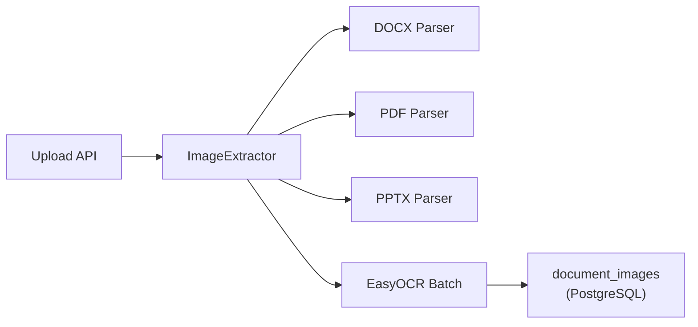

# OCR Sistemi — Backend Bileşen Dokümantasyonu

| Bilgi | Değer |
|-------|-------|
| **Versiyon** | v2.36.1 |
| **Son Güncelleme** | 2026-02-10 |
| **Konum** | `app/services/document_processors/image_extractor.py`, `app/services/ocr_service.py` |
| **Durum** | ✅ Güncel |

---

## 1. Amaç

DOCX, PDF ve PPTX dosyalarından görselleri çıkarma, EasyOCR ile metin tanıma ve veritabanına kaydetme.

---

## 2. Mimari



---

## 3. `ImageExtractor` Sınıfı

| Özellik | Değer |
|---------|-------|
| **Dosya** | `app/services/document_processors/image_extractor.py` |
| **Satır** | ~417 satır |

### `ImageExtractor.extract(file_content, file_type)`

**Input:**
| Parametre | Tip | Açıklama |
|-----------|-----|----------|
| `file_content` | `bytes` | Dosya binary |
| `file_type` | `str` | `.docx`, `.pdf`, `.pptx` |

**Output:** `List[ExtractedImage]`

### `ExtractedImage` Dataclass

```python
@dataclass
class ExtractedImage:
    image_data: bytes          # Görsel binary verisi
    image_format: str          # "png", "jpeg"
    image_index: int           # Sıra numarası
    width_px: int = 0          # Genişlik (piksel)
    height_px: int = 0         # Yükseklik (piksel)
    file_size_bytes: int = 0   # Dosya boyutu
    context_heading: str = ""  # İlgili başlık
    context_chunk_index: int = 0  # İlgili chunk
    alt_text: str = ""         # Alternatif metin
    ocr_text: str = ""         # OCR çıkarılan metin
```

---

## 4. OCR Batch İşlemi

### Desteklenen Formatlar (OCR)

| Format | OCR | Açıklama |
|--------|-----|----------|
| PNG | ✅ | Tam destek |
| JPEG | ✅ | Tam destek |
| BMP | ✅ | Tam destek |
| TIFF | ✅ | Tam destek |
| GIF | ✅ | İlk kare |
| EMF | ❌ | Windows metafile — OCR desteklenmiyor |
| WMF | ❌ | Windows metafile — OCR desteklenmiyor |

### `_run_ocr_batch(images)`

**Input:** `List[ExtractedImage]`  
**Output:** `None` (images listesi yerinde güncellenir — `ocr_text` alanı doldurulur)

**Özellikler:**
| Özellik | Detay |
|---------|-------|
| Paralellik | ThreadPoolExecutor (max_workers=4) |
| Fallback | OCR başarısızsa `ocr_text = ""` |
| RGBA | Otomatik RGB'ye dönüştürülür |
| Singleton | EasyOCR Reader 1 kez oluşturulur |

**Örnek:**
```python
extractor = ImageExtractor()
images = extractor.extract(file_bytes, ".docx")
# images[0].ocr_text → "Adım 1: VPN istemcisini açın"
```

---

## 5. Boyut Filtresi

Küçük ikonlar ve dekoratif görseller filtrelenir:

| Filtre | Değer | Açıklama |
|--------|-------|----------|
| Minimum genişlik | 50 px | Küçük ikonları atlar |
| Minimum yükseklik | 50 px | Küçük ikonları atlar |

---

## 6. DB Kayıt

### `save_images_to_db(images, file_id, conn)`

**Input:**
| Parametre | Tip | Açıklama |
|-----------|-----|----------|
| `images` | `List[ExtractedImage]` | Çıkarılan görseller |
| `file_id` | `int` | uploaded_files ID |
| `conn` | `connection` | DB bağlantısı |

**Output:** `List[int]` — Kaydedilen document_images ID listesi

**SQL:** 11 sütunlu INSERT
```sql
INSERT INTO document_images 
(file_id, image_index, image_data, image_format, width_px, height_px,
 file_size_bytes, context_heading, context_chunk_index, alt_text, ocr_text)
VALUES (%s, %s, %s, %s, %s, %s, %s, %s, %s, %s, %s) RETURNING id
```

---

## 7. Thread Safety

| Nokta | Güvenlik |
|-------|----------|
| EasyOCR Reader init | Thread-safe (singleton, module-level) |
| OCR batch çalıştırma | ThreadPoolExecutor ile izole |
| DB kayıt | Her kayıt ayrı transaction |
| Import hatası | Graceful fallback (reader=None) |
