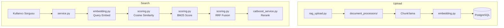

# RAG Pipeline — Backend Bileşen Dokümantasyonu

| Bilgi | Değer |
|-------|-------|
| **Versiyon** | v2.43.0 |
| **Son Güncelleme** | 2026-02-16 |
| **Konum** | `app/services/rag/` |
| **Durum** | ✅ Güncel |

---

## 1. Amaç

RAG (Retrieval-Augmented Generation) Pipeline, yüklenen dokümanlardan bilgi aramayı sağlar. Upload → Chunk → Embed → Search → Score → Rerank şeklinde çalışır.

---

## 2. Mimari



---

## 3. Bileşenler

### 3.1 `service.py` — Ana RAG Servisi

| Özellik | Değer |
|---------|-------|
| **Dosya** | `app/services/rag/service.py` |
| **Satır** | ~990 satır |
| **Amaç** | RAG arama orchestration |

#### `RAGService.search(query, user_id, org_ids, top_k)`

**Input:**
| Parametre | Tip | Varsayılan | Açıklama |
|-----------|-----|------------|----------|
| `query` | `str` | — | Arama sorgusu |
| `user_id` | `int` | None | Kullanıcı ID (kişiselleştirme) |
| `org_ids` | `List[int]` | None | Organizasyon filtresi |
| `top_k` | `int` | 5 | Sonuç sayısı |

**Output:** `List[Dict]`
```python
[
    {
        "chunk_id": 45,
        "chunk_text": "VPN bağlantısı için...",
        "file_name": "vpn_guide.pdf",
        "similarity_score": 0.87,
        "bm25_score": 0.72,
        "final_score": 0.82,
        "metadata": {"page": 3, "heading": "Bölüm 1", "heading_level": 2, "heading_path": ["Ana Bölüm", "Bölüm 1"], "image_ids": [1, 2]}
    }
]
```

**Arama Akışı:**
1. **Query Preprocessing** — Türkçe soru ekleri temizle (`nelerdir`, `nedir` → kaldır)
2. Query embedding oluştur (384 boyut)
3. DB'den tüm chunk embedding'lerle cosine similarity hesapla
4. BM25 metin skoru hesapla (**TOC chunk'lara %70 ceza**)
5. RRF (Reciprocal Rank Fusion) ile skorları birleştir
6. **TOC chunk final cezası** (%50 azaltma)
7. Exact match bonus (TOC hariç) + quality score
8. CatBoost reranking (varsa model)
9. **Score gap filtresi** (ardışık ≤25pt fark)
10. Top-K sonuç döndür

---

### 3.2 `embedding.py` — Vektör Embedding

| Özellik | Değer |
|---------|-------|
| **Dosya** | `app/services/rag/embedding.py` |
| **Model** | `all-MiniLM-L6-v2` |
| **Boyut** | 384 |
| **Amaç** | Metin → vektör dönüşümü |

#### `EmbeddingService.embed(text)`

**Input:** `str` — Metin  
**Output:** `List[float]` — 384 boyutlu vektör

#### `EmbeddingService.embed_batch(texts)`

**Input:** `List[str]` — Metin listesi  
**Output:** `List[List[float]]` — Vektör listesi

**Özellikler:**
- Singleton pattern (model 1 kez yüklenir)
- Lazy loading (ilk kullanımda yüklenir)
- Thread-safe

---

### 3.3 `scoring.py` — Puanlama

| Özellik | Değer |
|---------|-------|
| **Dosya** | `app/services/rag/scoring.py` |
| **Amaç** | Çoklu puanlama algoritmaları |

#### Puanlama Fonksiyonları

| Fonksiyon | Input | Output | Açıklama |
|-----------|-------|--------|----------|
| `cosine_similarity(v1, v2)` | 2× List[float] | float (0-1) | Vektör benzerliği |
| `batch_cosine_similarity(query, docs)` | query, List[docs] | List[float] | Toplu benzerlik |
| `bm25_score(query, doc)` | 2× str | float | BM25 metin skoru |
| `rrf_fusion(rankings, k=60)` | List[List[int]] | Dict[int, float] | Sıralama birleştirme |
| `exact_match_bonus(query, text)` | 2× str | float (0-0.15) | Teknik terim bonusu |

**Cosine Similarity Örneği:**
```python
from app.services.rag.scoring import cosine_similarity

score = cosine_similarity(
    [0.1, 0.2, 0.3, ...],  # query embedding
    [0.15, 0.22, 0.28, ...]  # chunk embedding
)
# → 0.87
```

---

### 3.4 `topic_extraction.py` — Konu Çıkarma

| Özellik | Değer |
|---------|-------|
| **Dosya** | `app/services/rag/topic_extraction.py` |
| **Amaç** | Doküman konusu otomatik belirleme |

**Desteklenen Konular:**
| Topic | Anahtar Kelimeler |
|-------|-------------------|
| `vpn` | vpn, anyconnect, cisco, tunnel |
| `outlook` | outlook, mail, e-posta, smtp |
| `network` | ağ, network, ip, dns, proxy |
| `excel` | excel, tablo, hücre, formül |
| `general` | Eşleşme yoksa varsayılan |

---

## 4. Upload Pipeline

### Chunk'lama Stratejisi
| Parametre | Değer |
|-----------|-------|
| Chunk boyutu | ~500 karakter |
| Overlap | 50 karakter |
| Metadata | Sayfa no, başlık, heading_level, heading_path, format |
| 🆕 Deduplication | Cosine sim ≥0.95 → kısa chunk kaldırılır |

### Embedding Stratejisi
| Parametre | Değer |
|-----------|-------|
| Model | SentenceTransformer (all-MiniLM-L6-v2) |
| Boyut | 384 float |
| Saklama | `rag_chunks.embedding` (FLOAT[]) |

---

## 5. CatBoost Reranking

RAG sonuçları CatBoost ML modeli ile yeniden sıralanır:

**15 Feature:**
| # | Feature | Açıklama |
|---|---------|----------|
| 1 | `cosine_similarity` | Vektör benzerliği |
| 2 | `exact_match_bonus` | Teknik terim eşleşmesi |
| 3 | `chunk_length` | Chunk karakter sayısı |
| 4 | `keyword_overlap` | Kelime örtüşmesi |
| 5 | `quality_score` | Chunk kalitesi |
| 6 | `topic_match` | Konu eşleşmesi |
| 7 | `user_topic_affinity` | Kullanıcı ilgi alanı |
| 8 | `chunk_recency_days` | Chunk yaşı |
| 9 | `historical_ctr` | Tıklama oranı |
| 10 | `word_count` | Kelime sayısı |
| 11 | `has_steps` | Adım içeriyor mu |
| 12 | `has_code` | Kod içeriyor mu |
| 13 | `query_length` | Sorgu uzunluğu |
| 14 | `source_file_type` | Dosya tipi |
| 15 | `heading_match` | Başlık eşleşmesi |

---

## 6. Bilinen Kısıtlamalar

| Kısıt | Detay |
|-------|-------|
| Embedding model boyutu | 384 (daha büyük modeller daha iyi sonuç verebilir) |
| Chunk sabit boyutlu | Semantik bölünme yok |
| Vektör DB yok | PostgreSQL FLOAT[] — pgvector kullanılmıyor |

---

## 7. Versiyon İyileştirmeleri

### v2.43.0
| Özellik | Açıklama |
|---------|----------|
| `_deduplicate_chunks()` | Cosine similarity 0.95+ duplicate kaldırma |
| Quality Score Bonus | Heading hiyerarşi derinliği (+0.1) |
| Quality Score Ceza | TOC (-0.3), dil karışıklığı (-0.1) |
| `_clean_header_footer_blocks()` | Header/footer temizleme (PDF) |
| `_detect_toc_section()` | İçindekiler `type: toc` işaretleme |

### v2.38.3
| Özellik | Açıklama |
|---------|----------|
| `_is_toc_chunk()` | İçindekiler tablosu algılama (nokta deseni + sayfa referansı) |
| `_preprocess_query()` | Türkçe soru ekleri temizleme (nelerdir, nedir, nasıl yapılır) |
| TOC Ceza Sistemi | BM25 %70 + Final %50 + Exact match engelleme |
| Score Gap | 10pt → 25pt (daha fazla ilgili sonuç) |
