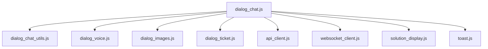

# Dialog Modülleri — Frontend Bileşen Dokümantasyonu

| Bilgi | Değer |
|-------|-------|
| **Versiyon** | v2.36.1 |
| **Son Güncelleme** | 2026-02-10 |
| **Konum** | `frontend/assets/js/modules/dialog_*.js` |
| **Durum** | ✅ Güncel |

---

## 1. Modül Listesi

| Modül | Dosya | Satır | Amaç |
|-------|-------|-------|------|
| **Dialog Chat** | `dialog_chat.js` | Ana | Chat UI orchestrator |
| **Dialog Utils** | `dialog_chat_utils.js` | Yardımcı | Markdown render, sanitize, scroll |
| **Dialog Voice** | `dialog_voice.js` | Sesli | Web Speech API entegrasyonu |
| **Dialog Images** | `dialog_images.js` | Görsel | Inline görsel render |
| **Dialog Ticket** | `dialog_ticket.js` | Ticket | Dialog'dan ticket oluşturma |

---

## 2. `dialog_chat.js` — Ana Chat Modülü

### Sorumluluklar
- Mesaj gönderme ve alma (WebSocket + HTTP fallback)
- Mesaj baloncuklarını DOM'a ekleme
- Quick reply butonlarını gösterme
- Geri bildirim (👍/👎) butonları
- Dialog listesi yönetimi

### Ana Fonksiyonlar

| Fonksiyon | Açıklama |
|-----------|----------|
| `initDialogChat()` | Modülü başlat, event listener'ları ekle |
| `sendMessage(text)` | Mesaj gönder (WS/HTTP) |
| `renderMessage(role, content, metadata)` | Mesaj baloncuğu oluştur |
| `renderSources(sources)` | Kaynak referanslarını göster |
| `handleFeedback(messageId, type)` | Geri bildirim kaydet |

### Event'ler
| Event | Tetikleyen | Davranış |
|-------|-----------|----------|
| `keydown(Enter)` | Kullanıcı | Mesaj gönder |
| `click(.send-btn)` | Kullanıcı | Mesaj gönder |
| `click(.feedback-btn)` | Kullanıcı | Geri bildirim API çağrısı |
| `ws.onmessage` | WebSocket | Yanıt render |

---

## 3. `dialog_chat_utils.js` — Yardımcı Fonksiyonlar

| Fonksiyon | Input | Output | Açıklama |
|-----------|-------|--------|----------|
| `renderMarkdown(text)` | string | HTML string | Markdown → HTML |
| `sanitizeHtml(html)` | string | string | XSS temizliği |
| `scrollToBottom(container)` | DOM element | void | Otomatik scroll |
| `formatTimestamp(date)` | Date | string | "14:30" formatı |
| `copyToClipboard(text)` | string | Promise | Panoya kopyala |

---

## 4. `dialog_voice.js` — Sesli Mesaj

### Web Speech API Entegrasyonu

| Özellik | Değer |
|---------|-------|
| API | Web Speech Recognition |
| Dil | `tr-TR` (Türkçe) |
| Continuous | `true` |

| Fonksiyon | Açıklama |
|-----------|----------|
| `startRecording()` | Mikrofonu aç, dinlemeye başla |
| `stopRecording()` | Dinlemeyi durdur |
| `onResult(event)` | Tanınan metni input'a yaz |

### Durum Yönetimi
```
IDLE → RECORDING → PROCESSING → IDLE
 🎤       🔴          ⏳         🎤
```

---

## 5. `dialog_images.js` — Görsel Yönetimi

| Fonksiyon | Açıklama |
|-----------|----------|
| `initImageHandlers()` | Görsel tıklama event'lerini ekle |
| `showImageLightbox(imgElement)` | Büyütülmüş görsel göster |
| `loadImageOCR(imageId)` | OCR metnini popup'ta göster |

---

## 6. Bağımlılık Zinciri


