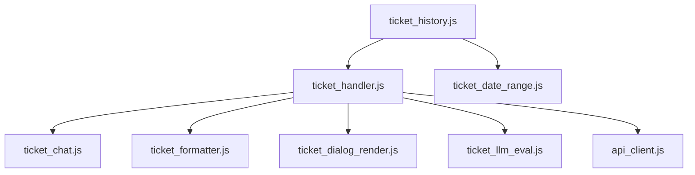

# Ticket Modülleri — Frontend Bileşen Dokümantasyonu

| Bilgi | Değer |
|-------|-------|
| **Versiyon** | v2.36.1 |
| **Son Güncelleme** | 2026-02-10 |
| **Konum** | `frontend/assets/js/modules/ticket_*.js`, `frontend/assets/js/ticket_history.js` |
| **Durum** | ✅ Güncel |

---

## 1. Modül Listesi

| Modül | Dosya | Amaç |
|-------|-------|------|
| **Ticket Handler** | `ticket_handler.js` | Ticket oluşturma ve API çağrıları |
| **Ticket Chat** | `ticket_chat.js` | Ticket mesaj görünümü |
| **Ticket Formatter** | `ticket_formatter.js` | Mesaj ve çözüm formatlama |
| **Ticket Date Range** | `ticket_date_range.js` | Tarih filtresi |
| **Ticket Dialog Render** | `ticket_dialog_render.js` | Dialog → ticket render |
| **Ticket LLM Eval** | `ticket_llm_eval.js` | LLM değerlendirme görünümü |
| **Ticket History** | `ticket_history.js` | Geçmiş liste yönetimi |

---

## 2. Ana Fonksiyonlar

### `ticket_handler.js`
| Fonksiyon | Açıklama |
|-----------|----------|
| `createTicket(dialogId)` | Dialog'dan ticket oluştur |
| `fetchTickets(filters)` | Ticket listesini getir |
| `openTicketDetail(ticketId)` | Ticket detay modalı |

### `ticket_history.js`
| Fonksiyon | Açıklama |
|-----------|----------|
| `initTicketHistory()` | Geçmiş sekmesini başlat |
| `renderTicketList(tickets)` | Kart listesini DOM'a ekle |
| `filterByDate(start, end)` | Tarih aralığı filtresi |
| `filterByStatus(status)` | Durum filtresi |

### `ticket_llm_eval.js`
| Fonksiyon | Açıklama |
|-----------|----------|
| `showEvaluation(ticketId)` | LLM değerlendirmesini göster |
| `renderEvalCard(evalData)` | Değerlendirme kartını render et |

---

## 3. Bağımlılık Zinciri

